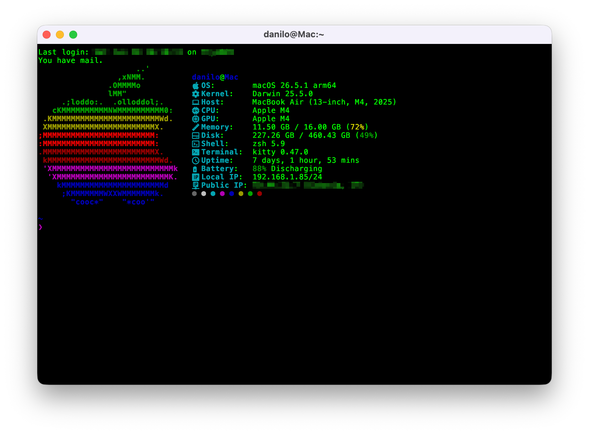

<div align="center">

# fastfetch-config

A clean and minimal [fastfetch](https://github.com/fastfetch-cli/fastfetch) configuration built to work across operating systems.

Developed and tested on macOS, Arch Linux, Ubuntu, and Windows.



</div>

---

## Preview

The configuration displays system information in a logical, grouped layout:

- **Identity** — user, OS, kernel, host
- **Hardware** — CPU, GPU, memory (with percentage), disk (with percentage)
- **Session** — shell, terminal
- **Status** — uptime, battery (with charge status and time remaining)
- **Network** — local IP, public IP
- **Palette** — terminal color circles

The layout is intentionally simple so it stays readable on different terminals and platforms.
---

## Requirements

- A supported operating system: macOS, Arch Linux, Ubuntu, or Windows
- [fastfetch](https://github.com/fastfetch-cli/fastfetch) ≥ 2.0
- A [Nerd Font](https://www.nerdfonts.com/) installed and set as your terminal font (for icons to render correctly)

Install fastfetch with the package manager that matches your system, for example:

```bash
# macOS
brew install fastfetch

# Arch Linux
sudo pacman -S fastfetch

# Ubuntu
sudo apt install fastfetch
```

```powershell
# Windows (PowerShell)
winget install fastfetch
```

---

## Installation

1. Clone this repository:

```bash
git clone https://github.com/daniloscimone/fastfetch-config.git
```

2. Copy the config file to your fastfetch config directory:

```bash
# macOS / Linux
cp fastfetch-config/config.jsonc ~/.config/fastfetch/config.jsonc

```

```powershell
Copy-Item .\fastfetch-config\config.jsonc $env:APPDATA\fastfetch\config.jsonc
```
3. Run fastfetch:

```bash
fastfetch
```

---

## Configuration

On macOS and Linux, the config file is usually located at `~/.config/fastfetch/config.jsonc`.
On Windows, it is usually located at `%APPDATA%\fastfetch\config.jsonc`.

Key choices:

| Option | Value | Notes |
|--------|-------|-------|
| `binaryPrefix` | `jedec` | Uses GB/MB instead of GiB/MiB |
| `key.width` | `14` | Aligns all key labels |
| `keys color` | `cyan` | Clean cyan for all labels |
| Memory format | `{used} / {total} ({percentage})` | Shows percentage inline |
| Disk format | `{size-used} / {size-total} ({size-percentage})` | Shows percentage inline |
| Battery format | `{capacity} ({status}) {time-remaining}` | Capacity + status + time |
| Colors symbol | `circle` | Minimal circle dots palette |

---

## License

MIT
