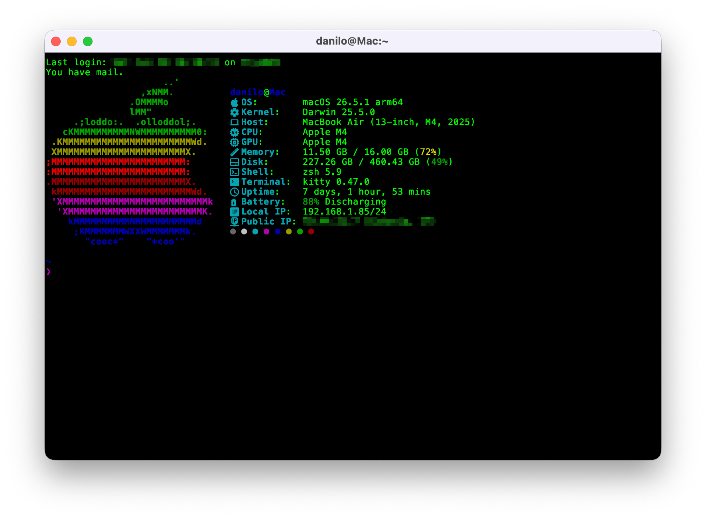

<div align="center">

# fastfetch-config

A clean, minimal [fastfetch](https://github.com/fastfetch-cli/fastfetch) configuration that looks the same everywhere.

Developed and tested on **macOS**, **Arch Linux**, **Ubuntu** and **Windows**.



</div>

---

## Install

One command sets up everything — fastfetch, a Nerd Font, and this configuration.

**macOS and Linux**

```bash
curl -fsSL https://raw.githubusercontent.com/daniloscimone/fastfetch-config/main/install.sh | bash
```

**Windows** (PowerShell, no administrator rights needed)

```powershell
irm https://raw.githubusercontent.com/daniloscimone/fastfetch-config/main/install.ps1 | iex
```

The installer will:

1. **Install fastfetch** with your system's package manager — Homebrew, pacman, apt, dnf, zypper, apk, xbps, eopkg, emerge, pkg, nix on Unix; winget, Scoop or Chocolatey on Windows. If none of them has the package, it falls back to the official release binary.
2. **Install JetBrainsMono Nerd Font** for the current user, so the icons render.
3. **Install `config.jsonc`** into fastfetch's own config directory. An existing config is copied to `config.jsonc.backup-<timestamp>` first — nothing is overwritten silently.
4. **Run fastfetch** so you can see the result immediately.

Re-running the installer is safe: anything already in place is left alone.

Afterwards, set your terminal font to **JetBrainsMono Nerd Font** — see [Set the terminal font](#4-set-the-terminal-font).

### Install from a clone

If you would rather read the script before running it:

```bash
git clone https://github.com/daniloscimone/fastfetch-config.git
cd fastfetch-config
./install.sh
```

```powershell
git clone https://github.com/daniloscimone/fastfetch-config.git
cd fastfetch-config
.\install.ps1
```

> On Windows you may need `Set-ExecutionPolicy -Scope Process -ExecutionPolicy Bypass` first.

### Options

| `install.sh` | `install.ps1` | What it does |
|---|---|---|
| `--font NAME` | `-FontName NAME` | Install a different [Nerd Font](https://www.nerdfonts.com/font-downloads) (`Hack`, `FiraCode`, `Meslo`, `CascadiaCode`, `Iosevka`, …). Default: `JetBrainsMono` |
| `--font-full` | `-FontFull` | Install every weight and variant instead of Regular / Bold / Italic / BoldItalic |
| `--no-font` | `-NoFont` | Skip the font entirely |
| `--no-fastfetch` | `-NoFastfetch` | Install only the config, leave fastfetch alone |
| `--help` | `Get-Help .\install.ps1` | Show usage |

```bash
./install.sh --font Hack
```

```powershell
.\install.ps1 -FontName Hack
```

---

## Manual install

### 1. Install fastfetch

| System | Command |
|---|---|
| macOS | `brew install fastfetch` |
| Arch Linux | `sudo pacman -S fastfetch` |
| Debian / Ubuntu | `sudo apt install fastfetch` |
| Fedora | `sudo dnf install fastfetch` |
| openSUSE | `sudo zypper install fastfetch` |
| Alpine | `sudo apk add fastfetch` |
| Void Linux | `sudo xbps-install -S fastfetch` |
| Windows | `winget install Fastfetch-cli.Fastfetch` |
| Windows (Scoop) | `scoop install fastfetch` |

fastfetch **2.0 or newer** is required. On older Debian and Ubuntu releases the package may be missing from the repositories — grab the `.deb` from the [releases page](https://github.com/fastfetch-cli/fastfetch/releases) instead.

### 2. Install a Nerd Font

The config uses Nerd Font icons for every label. Without one you will see empty boxes.

Download [JetBrainsMono Nerd Font](https://github.com/ryanoasis/nerd-fonts/releases/latest/download/JetBrainsMono.tar.xz) and install it:

- **macOS** — unpack and copy the `.ttf` files into `~/Library/Fonts`
- **Linux** — copy them into `~/.local/share/fonts/`, then run `fc-cache -f`
- **Windows** — select the `.ttf` files, right-click and choose *Install for all users*

### 3. Copy the config

```bash
git clone https://github.com/daniloscimone/fastfetch-config.git
mkdir -p ~/.config/fastfetch
cp fastfetch-config/config.jsonc ~/.config/fastfetch/config.jsonc
```

```powershell
git clone https://github.com/daniloscimone/fastfetch-config.git
New-Item -ItemType Directory -Force "$env:USERPROFILE\.config\fastfetch"
Copy-Item .\fastfetch-config\config.jsonc "$env:USERPROFILE\.config\fastfetch\config.jsonc"
```

Not sure where your config should go? Ask fastfetch — the first path it prints is the one it prefers:

```bash
fastfetch --list-config-paths
```

### 4. Set the terminal font

| Terminal | Where |
|---|---|
| Terminal.app | Settings → Profiles → Text → Font |
| iTerm2 | Settings → Profiles → Text → Font |
| Ghostty | `font-family = "JetBrainsMono Nerd Font"` in `~/.config/ghostty/config` |
| Kitty | `font_family JetBrainsMono Nerd Font` in `~/.config/kitty/kitty.conf` |
| Alacritty | `font.normal.family: "JetBrainsMono Nerd Font"` |
| WezTerm | `font = wezterm.font("JetBrainsMono Nerd Font")` |
| GNOME Terminal | Preferences → Profile → Text → Custom font |
| Konsole | Settings → Edit Profile → Appearance → Font |
| Windows Terminal | Settings → Profiles → Defaults → Appearance → Font face |

### 5. Run it

```bash
fastfetch
```

To print it on every new shell, add `fastfetch` to `~/.zshrc`, `~/.bashrc`, or `$PROFILE` on Windows.

---

## What it shows

The layout is grouped so the output stays readable on any terminal width:

- **Identity** — user@host, OS, kernel, host model
- **Hardware** — CPU, GPU, memory and disk, each with a usage percentage
- **Session** — shell, terminal
- **Status** — uptime, battery with charge state
- **Network** — local IP, public IP
- **Palette** — the terminal's 16 colors as circles

## Configuration

| Option | Value | Why |
|---|---|---|
| `logo.type` | `auto` | Each OS shows its own logo |
| `display.key.width` | `14` | Keeps every value aligned in one column |
| `display.color.keys` | `cyan` | One accent color for all labels |
| `display.color.title` | `blue` | Highlights the user@host line |
| `display.size.binaryPrefix` | `jedec` | GB / MB instead of GiB / MiB |
| Memory format | `{used} / {total} ({percentage})` | Percentage inline |
| Disk format | `{size-used} / {size-total} ({size-percentage})` | Percentage inline, root volume only |
| Battery format | `{capacity} {status}` | Charge level plus charging state |
| `colors.symbol` | `circle` | Minimal palette row |

Every module is documented in the [fastfetch wiki](https://github.com/fastfetch-cli/fastfetch/wiki/Configuration). The top of `config.jsonc` keeps a commented copy of the full default configuration as a quick reference for options you may want to turn on.

---

## Troubleshooting

**Icons show as boxes, question marks or blank squares**
The terminal is not using a Nerd Font. Install one and select it in your terminal settings — the font used by the *terminal* is what matters, not the editor.

**`fastfetch: command not found` right after installing**
The installer added it to a directory that your current shell has not picked up yet. Open a new terminal, or run `export PATH="$HOME/.local/bin:$PATH"`.

**Public IP takes a moment or shows nothing**
It requires a network round trip. Raise the timeout, or drop the `publicip` module from `config.jsonc` if you do not need it.

**No battery line**
Expected on desktops and most VMs — fastfetch skips modules that do not apply.

**Values are misaligned**
Some fonts render icons at double width. Use the `JetBrainsMono Nerd Font Mono` variant (also installed by the script), or raise `display.key.width`.

---

## Uninstall

```bash
rm ~/.config/fastfetch/config.jsonc
rm ~/.local/share/fonts/NerdFonts/JetBrainsMonoNerdFont*   # Linux
rm ~/Library/Fonts/JetBrainsMonoNerdFont*                  # macOS
```

```powershell
Remove-Item "$env:USERPROFILE\.config\fastfetch\config.jsonc"
Remove-Item "$env:LOCALAPPDATA\Microsoft\Windows\Fonts\JetBrainsMonoNerdFont*"
```

If you had a config before, restore the backup the installer left next to it:

```bash
mv ~/.config/fastfetch/config.jsonc.backup-* ~/.config/fastfetch/config.jsonc
```

---

## Credits

- [fastfetch](https://github.com/fastfetch-cli/fastfetch) by the fastfetch-cli team
- [Nerd Fonts](https://github.com/ryanoasis/nerd-fonts) by Ryan L McIntyre

## License

MIT
